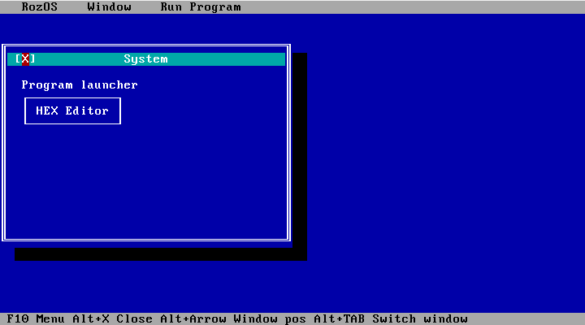

# Zestaw do tworzenia systemów w kernel c
Ten zestaw wspiera interface TUI i autorską bibliotekę RozOS TUI Framework



<a href="https://github.com/ROZcloud/ROZcloud.github.io/archive/refs/heads/main.zip" style="
    background-color: #007bff; 
    color: white; 
    padding: 10px 20px; 
    text-decoration: none; 
    border-radius: 5px; 
    font-weight: bold;">
    Pobierz pakiet
</a>

# Opis w AI:
# RozOS (by ROZcloud)
Autorski system operacyjny pisany w języku C.

## Przegląd techniczny
System obsługuje niskopoziomowe operacje sprzętowe oraz posiada własny framework GUI.

### Główne funkcjonalności:
* **Zarządzanie I/O**: Bezpośredni dostęp do portów (`inb`, `outb`).
* **Zarządzanie energią**: Obsługa tablic ACPI (FADT).
* **GUI Framework**: Własne środowisko TUI z systemem okienkowym.
* **Interpreter**: Wbudowany `run_hex` do wykonywania kodu maszynowego.

## Przykład kodu (Komunikacja z portem)

Poniżej znajduje się implementacja odczytu słowa (16-bit) z portu:

```c
static inline uint16_t inw(unsigned short port) {
    uint16_t ret;
    asm volatile ( "inw %1, %0" : "=a"(ret) : "Nd"(port) );
    return ret;
}
```
# Jak zdecydowałem się zrobić system RozOS
Historia Różo sjest długa wszystko zaczęło się, gdy poznałem linux wtedy zobaczyłem jak działają systemy to nie tylko okna jak w windows postanowiłem zrobić prosty system „dysk blokada”, ale nie widziałem, jak programować w ASM użyłem ChatGPT do stworzenia kodu w ASM, który wyświetla „System zablokowany” na niebieskim tle. Projekt porzuciłem bardzo szybko zacząłem robić kody w C++ lub Python emulującze system do minimalistycznego samemu skompilowanego Debiana projekt miał wsparcie około 3 lata dzisiaj projekt jest zatrzymany, ale będzie kontynuawany potem AI zrobiło kilka instrukcji w kernel, ale nie interesowałem się tym i robiłem te aplikacje potem znalazłem te pliki i napisałem RozOS TUI Framework i resztę systemu, ale znowu został porzuczony kali linux, na którym go pisałem miał zainstalowane sterowniki do karty graficznej i nie działał na innym komputerze, a ten komputer się zepsuł pliki odzyskałem 2 miesiącze później poprawiłem i powstała ta strona.
<div style="position: absolute; z-index: 99999">
    <input autocomplete="off" type="checkbox" id="aadsstickymrjelpt8" hidden />
    <div style="padding-top: auto; padding-bottom: 0;">
        <div style="width:100%;height:auto;position:fixed;text-align:center;font-size:0;top:0;left:0;right:0;margin:auto">
            <label for="aadsstickymrjelpt8" style="top: 50%;transform: translateY(-50%);right:24px; position: absolute;border-radius: 4px; background: rgba(248, 248, 249, 0.70); padding: 4px;z-index: 99999;cursor:pointer">
                <svg fill="#000000" height="16px" width="16px" xmlns="http://www.w3.org/2000/svg" viewBox="0 0 490 490">
                    <polygon points="456.851,0 245,212.564 33.149,0 0.708,32.337 212.669,245.004 0.708,457.678 33.149,490 245,277.443 456.851,490 489.292,457.678 277.331,245.004 489.292,32.337 "/>
                </svg>
            </label>
            <div id="frame" style="width: 100%;margin: auto;position: relative; z-index: 99998;"><iframe data-aa=2447857 src=//acceptable.a-ads.com/2447857/?size=Adaptive style='border:0; padding:0; width:70%; height:auto; overflow:hidden; margin: auto'></iframe></div>
        </div>
        <style>
            #aadsstickymrjelpt8:checked + div { display: none; }
        </style>
    </div>
</div>
